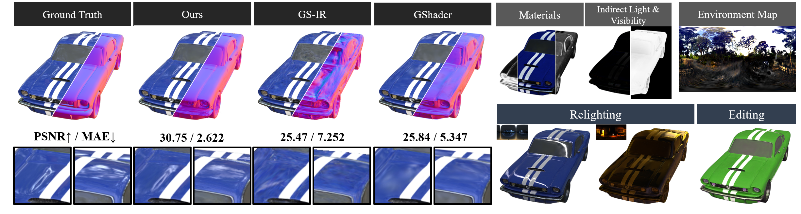

# RTR-GS: 3D Gaussian Splatting for Inverse Rendering with Radiance Transfer and Reflection  (MM 2025)

### <p align="center">  [🖨️ArXiv](https://arxiv.org/pdf/2507.07733) | [📰Paper](https://dl.acm.org/doi/abs/10.1145/3746027.3755197)</p>

<p align="center">
<a target="_blank">Yongyang Zhou<sup>1</sup></a>, <a target="_blank">Fanglue Zhang<sup>2</sup></a>, <a target="_blank">Zichen Wang<sup>1</sup></a>, <a target="_blank">Lei Zhang<sup>1</sup></a>, </i></sup></a></h5> <br><sup>1</sup>Beijing Institute of Technology <sup>2</sup>Victoria University of Wellington 
</p>


This is official implement of RTR-GS for the paper *RTR-GS: 3D Gaussian Splatting for Inverse Rendering with Radiance Transfer and Reflection*.



### Installation

#### Clone this repo

```shell
git clone https://github.com/ZyyZyy06/RTR-GS.git
```

#### Install dependencies

```shell
# install environment
conda env create --file environment.yml
conda activate rtr-gs

# install pytorch=1.12.1
conda install pytorch==1.12.1 torchvision==0.13.1 torchaudio==0.12.1 cudatoolkit=11.6 -c pytorch -c conda-forge

# install torch_scatter==2.1.1
pip install torch_scatter==2.1.1

# install kornia==0.6.12
pip install kornia==0.6.12

# install nvdiffrast=0.3.1
git clone https://github.com/NVlabs/nvdiffrast
pip install ./nvdiffrast
```

#### Install the pytorch extensions

We recommend that users compile the extension with CUDA 11.6 to avoid the potential problems.

```shell
# install knn-cuda
pip install ./submodules/simple-knn

# install rtr-gs-rasterization
pip install ./submodules/rtr_gs-rasterization

# install baking module from gs-ir
pip install ./submodules/gs-ir
pip install ./submodules/diff-gaussian-rasterization
# or
cd ./submodules/diff-gaussian-rasterization
python setup.py develop


```

**## Dataset**

We evaluate our method on [TensoIR-Synthetic](https://zenodo.org/records/7880113#.ZE68FHZBz18), [Shiny Blender Sysnthetic](https://storage.googleapis.com/gresearch/refraw360/ref.zip)，[Shiny Blender Real](https://storage.googleapis.com/gresearch/refraw360/ref_real.zip), and [Stanford ORB](https://github.com/StanfordORB/Stanford-ORB)  datasets. We regenerated the Shiny Blender Synthetic dataset from the original Blender files for our relighting tests, keeping the format consistent.


### Running

We run the code in a single NVIDIA GeForce RTX 3090 GPU (24G). We have written corresponding run scripts for different datasets, including training, testing, relighting, and more. For example, if you want to test on the TensoIR dataset, please edit the $root\_dir$  and output_path in $script/run\_synthetic.sh$, and run the following command:

```sh
# For TensoIR or ShinyBlender Synthetic
sh script/run_synthetic.sh
# For StanfordORB
sh script/run_orb.sh
# For Mipnerf360 or Shiny Blender Real
sh script/run_real_scene.sh
```

We have written all the commands for training, baking, evaluation, and re lighting evaluation in the script.

Here are explanations of some important control parameters：

```sh
--compute_with_prt #using prt to instead of sh.
--ref_map #using reflection map
-t #render_ref(Hybrid rendering model) render_ref_pbr(Add pbr branch)
```


### Trying on your own data

We recommend that users reorganize their own data as nerf-synthetic dataset and then optimize.

### Citation

If you find our work useful in your research, please be so kind to cite:

```
@inproceedings{10.1145/3746027.3755197,
author = {Zhou, Yongyang and Zhang, Fanglue and Wang, Zichen and Zhang, Lei},
title = {RTR-GS: 3D Gaussian Splatting for Inverse Rendering with Radiance Transfer and Reflection},
year = {2025},
isbn = {9798400720352},
publisher = {Association for Computing Machinery},
address = {New York, NY, USA},
url = {https://doi.org/10.1145/3746027.3755197},
doi = {10.1145/3746027.3755197},
abstract = {3D Gaussian Splatting (3DGS) has demonstrated impressive capabilities in novel view synthesis. However, rendering reflective objects remains a significant challenge, particularly in inverse rendering and relighting. We introduce RTR-GS, a novel inverse rendering framework capable of robustly rendering objects with arbitrary reflectance properties, decomposing BRDF and lighting, and delivering credible relighting results. Given a collection of multi-view images, our method effectively recovers geometric structure through a hybrid rendering model that combines forward rendering for radiance transfer with deferred rendering for reflections. This approach successfully separates high-frequency and low-frequency appearances, mitigating floating artifacts caused by spherical harmonic overfitting when handling high-frequency details. We further refine BRDF and lighting decomposition using an additional physically-based deferred rendering branch. Experimental results show that our method enhances novel view synthesis, normal estimation, decomposition, and relighting while maintaining efficient training inference process.},
booktitle = {Proceedings of the 33rd ACM International Conference on Multimedia},
pages = {6888–6897},
numpages = {10},
keywords = {gaussian splatting, novel view synthesis, relighting},
location = {Dublin, Ireland},
series = {MM '25}
}
```